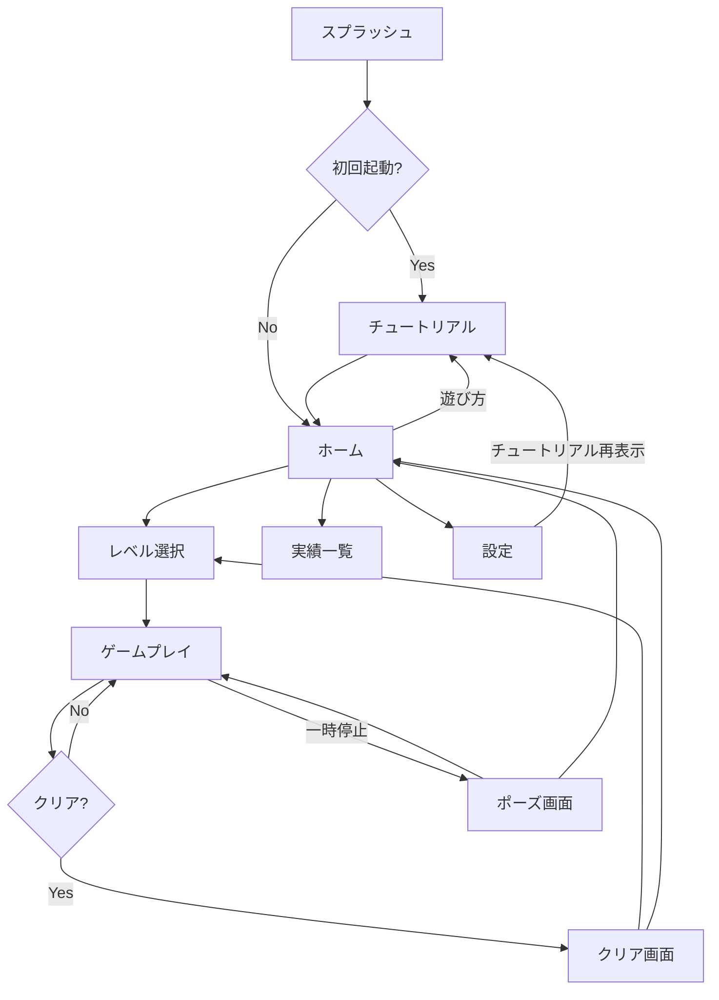

# IroPre — Product Requirements Document

> **Version:** 1.2
> **Date:** 2026-03-06
> **Status:** Draft
> **Platform:** iOS 18+ (SwiftUI)
> **Team:** PM / Lead Engineer / Engineer / Designer (All Claude AI Agent)

---

## Table of Contents

- [1. Executive Summary](#1-executive-summary)
- [2. Product Overview](#2-product-overview)
- [3. Game Design](#3-game-design)
- [4. Feature Specification](#4-feature-specification)
- [5. Technical Architecture](#5-technical-architecture)
- [6. Screen Flow](#6-screen-flow)
- [7. UI/UX Design Direction](#7-uiux-design-direction)
- [8. Quality & Security](#8-quality--security)
- [9. Development Roadmap](#9-development-roadmap)
- [10. Success Metrics](#10-success-metrics)
- [Appendix: Claude Code Agent向けメモ](#appendix-claude-code-agent向けメモ)
- [更新履歴](#更新履歴)

---

## 1. Executive Summary

IroPreは、従来の数字ベースの数独を「色」に置き換えることで、年齢や数字への苦手意識に関係なく誰でも直感的に楽しめるパズルゲームアプリです。4×4・6×6・9×9の3種類の盤面とレベル1〜100の段階的な難易度で、初心者から上級者まで幅広いユーザーに対応します。

### 解決する課題

- 数独は「数字が難しそう」という心理的ハードルが高い
- 子どもやシニアが気軽に楽しめるパズルアプリが少ない
- 色覚多様性に配慮したパズルゲームがほとんどない

### 差別化ポイント

- 数字→色の置き換えによる直感的なゲーム体験
- 3Dポップなビジュアルで触りたくなるUI
- 色覚アクセシビリティ（パターン/シンボルモード）の標準搭載
- 4×4からの段階的な盤面拡大で挫折しにくい設計

---

## 2. Product Overview

### 2.1 プロダクトビジョン

> 「色で解く、新しい数独体験」——数字の代わりに色を使うことで、言語や年齢の壁を超え、誰もが楽しめるパズルゲームを提供する。

### 2.2 アプリ名称

| 項目 | 内容 |
|:--|:--|
| アプリ名 | **IroPre** |
| 読み | いろぷれ |
| 由来 | 色（Iro）+ ナンバープレース（Number Place → Pre） |
| App Store サブタイトル | 色で解くパズル - Color Sudoku |
| Bundle ID（案） | `com.example.iropre` |

### 2.3 ターゲットユーザー

| セグメント | 年齢層 | 特徴 | 利用シーン |
|:--|:--|:--|:--|
| キッズ | 4〜12歳 | 色で遊ぶ感覚、小さい盤面からスタート | 移動中・待ち時間 |
| カジュアル | 13〜40歳 | 気軽に脳トレ、短時間プレイ | 通勤・休憩時間 |
| シニア | 60歳以上 | 色の視覚的なわかりやすさ | 日常の脳活性化 |
| パズル愛好家 | 全年齢 | 高難易度・実績コンプリート | やり込みプレイ |

### 2.4 ビジネスモデル

**基本モデル:** 無料アプリ + 広告収益

- **バナー広告:** ホーム画面下部に常時表示
- **インタースティシャル広告:** レベルクリア時に表示（3レベルに1回程度）
- **将来検討:** 広告除去課金、テーマパック購入

---

## 3. Game Design

### 3.1 コアルール

数独のルールをそのまま踏襲し、数字を色に置き換えます。

1. 空いているマスに指定の色のいずれかを配置する
2. 縦・横の各列に、同じ色が重複してはならない
3. 太線で囲まれたブロック内に、同じ色が重複してはならない

### 3.2 盤面サイズ

| サイズ | 色数 | ブロック | ブロック形状 | 対象レベル | 推奨ユーザー |
|:--|:--|:--|:--|:--|:--|
| 4×4 | 4色 | 2×2 | 2行×2列（正方形） | Lv.1〜20 | 初心者・子供 |
| 6×6 | 6色 | 2×3 | 2行×3列（横長） | Lv.21〜50 | 中級者 |
| 9×9 | 9色 | 3×3 | 3行×3列（正方形） | Lv.51〜100 | 上級者 |

> **補足:** 6×6盤面のブロックは横長（2行×3列）を採用。縦長よりも横方向の視線移動が自然で、スマートフォンのポートレート表示と相性が良い。

### 3.3 レベルシステム（Lv.1〜100）

レベルが上がるにつれ、以下のパラメータが段階的に変化します。

- **盤面サイズ:** 4×4 → 6×6 → 9×9 へ段階的に拡大
- **初期配置色数:** レベルが上がるほどヒントとなる初期配置が減少
- **解法難易度:** 単純消去法 → 候補絞り込み → 高度なテクニックが必要
- **タイムボーナス:** 一定時間内クリアでボーナススコア（任意）

### 3.4 カラーパレット

ライトモードで9色、ダークモードで9色の合計18色を用意します。

**ライトモード:**

| スロット | 色名 | Hex | 用途 |
|:--|:--|:--|:--|
| 1 | レッド | `#FF6B6B` | 暖色系アクセント |
| 2 | ブルー | `#4A90D9` | メインカラー |
| 3 | グリーン | `#27AE60` | 成功・正解 |
| 4 | イエロー | `#F1C40F` | 注意・ハイライト |
| 5 | パープル | `#9B59B6` | アクセント |
| 6 | オレンジ | `#E67E22` | 暖色系サブ |
| 7 | ピンク | `#FF9FF3` | 柔らかいアクセント |
| 8 | シアン | `#00CEC9` | 寒色系サブ |
| 9 | ライム | `#BADC58` | 自然系 |

**ダークモード:**

| スロット | 色名 | Hex | 用途 |
|:--|:--|:--|:--|
| 1 | チェリー | `#E74C3C` | 暖色系アクセント |
| 2 | スカイ | `#3498DB` | メインカラー |
| 3 | エメラルド | `#2ECC71` | 成功・正解 |
| 4 | ゴールド | `#F39C12` | 注意・ハイライト |
| 5 | アメジスト | `#8E44AD` | アクセント |
| 6 | サンセット | `#D35400` | 暖色系サブ |
| 7 | ローズ | `#FD79A8` | 柔らかいアクセント |
| 8 | ティール | `#00B894` | 寒色系サブ |
| 9 | オリーブ | `#6AB04C` | 自然系 |

### 3.5 色覚アクセシビリティ対応

色覚多様性（色盲・色弱）への対応はゲームの核心機能です。以下の施策を実装します。

1. **パターンオーバーレイ:** 各色に固有のパターン（ドット・ストライプ・クロスハッチ等）を重ねて表示
2. **ハイコントラストモード:** 色の彩度とコントラストを強化
3. **シンボルモード:** 色の代わりにアイコン（★●■▲◆等）で表示
4. **設定からワンタップで切り替え可能**

### 3.6 操作フロー

色の配置は「カラーファースト」方式を採用します。

1. **パレットから色を選択**（選択中の色はパレット上でハイライト表示）
2. **盤面の空きマスをタップ**して色を配置
3. **選択中の色は配置後も維持**（連続配置モード）
4. **同じ色をもう一度タップ**するとパレットの選択を解除

> **設計意図:** 同じ色を複数マスに連続で配置できるため、テンポの良いプレイ体験を実現。チュートリアルのStep 3でこの操作フローを体験させる。

---

## 4. Feature Specification

### 4.1 MVP機能一覧

| 優先度 | 機能 | 説明 | ステータス |
|:--|:--|:--|:--|
| P0 | ゲームプレイ | 色をタップで配置してパズルを解く | MVP |
| P0 | レベル選択 | Lv.1〜100のレベル選択画面 | MVP |
| P0 | カラーパレット | タップで色を選択するパレットUI（連続配置モード） | MVP |
| P0 | チュートリアル | 初回起動時のインタラクティブガイド（4ステップ） | MVP |
| P0 | ヒント機能 | 正解の色を一つ表示 / 誤りハイライト | MVP |
| P0 | エラーチェック | 現在の誤りをハイライト表示（使用時スコア減点） | MVP |
| P0 | undo（元に戻す） | 操作を元に戻す（全手戻し対応） | MVP |
| P0 | 実績システム | クリア回数・タイム等の実績解除 | MVP |
| P0 | ダークモード | ライト/ダーク切り替え対応（ゲーム中はロック） | MVP |
| P0 | 色覚アクセシビリティ | パターン/シンボルモード | MVP |
| P1 | タイマー | プレイ時間表示とベストタイム記録 | v1.1 |
| P1 | 広告統合 | AdMobバナー + インタースティシャル | v1.1 |
| P2 | 統計ダッシュボード | クリア率・平均タイム等の統計 | v1.2 |
| P2 | デイリーチャレンジ | 毎日新しい問題が出る日替わりモード | v1.2 |
| P2 | メモ機能 | 候補色を小さく表示する上級者向け機能 | v1.2 |
| P2 | BGM | バックグラウンドミュージック再生 | v1.2 |

### 4.2 チュートリアル詳細

初回起動時に4ステップのインタラクティブチュートリアルを表示します。ホーム画面の「遊び方」ボタンおよび設定画面の「チュートリアルを再表示」から再アクセス可能です。

| Step | 内容 | 表示方法 |
|:--|:--|:--|
| 1 | ゲームの紹介 | 「色で数独を解こう！」のウェルカムメッセージ |
| 2 | ルール説明 | 縦・横・ブロックのルールをアニメーション付きで説明 |
| 3 | 実践練習 | 2×2のミニパズルで「色を選ぶ→マスをタップ」の操作を体験 |
| 4 | ツール紹介 | ヒント・戻す・消すの3ツールを紹介 |

### 4.3 ヒントシステム

| ヒント種別 | 説明 | 回数制限 | スコアへの影響 |
|:--|:--|:--|:--|
| マスヒント | 選択中のマスの正解色を表示 | 各1パズル3回 | 使用ごとに★評価が1段階低下 |
| エラーチェック | 現在の誤りをハイライト表示 | 各1パズル5回 | 使用ごとにスコア-50pt |
| ブロックヒント | 指定ブロック内の1色を確定 | 各1パズル1回 | 使用ごとに★評価が1段階低下 |

### 4.4 undo（元に戻す）機能

- 操作履歴を配列で保持し、**全手戻し**に対応
- 1タップで直前の操作を取り消し
- 長押しで全操作リセット（確認ダイアログ表示）
- 履歴はゲーム終了時にクリア

### 4.5 実績システム

ユーザーのモチベーションを維持するための実績バッジシステムです。

| カテゴリ | 実績例 | 解除条件 |
|:--|:--|:--|
| ビギナー | はじめの一歩 | 初めてパズルをクリア |
| スピード | カラーマスター | Lv.30を60秒以内クリア |
| コレクション | レインボーコンプリート | 全盤面サイズで各レベルをクリア |
| チャレンジ | ノーヒントマスター | ヒント未使用でLv.50クリア |
| 継続 | 7日連続プレイ | 7日連続でゲームをプレイ |

### 4.6 ダークモード仕様

- ライトモードとダークモードで別の9色カラーパレットを使用（セクション3.4参照）
- **ゲームプレイ中はモード切り替えをロック**（配置済みの色が変わる混乱を防止）
- ホーム画面・設定画面でのみ切り替え可能
- iOS システム設定との自動連動にも対応

### 4.7 画面回転対応

- **MVPではポートレート（縦画面）固定**
- `Info.plist`で`UISupportedInterfaceOrientations`をportrait onlyに設定
- 将来バージョンでiPadランドスケープ対応を検討

---

## 5. Technical Architecture

### 5.1 技術スタック

| レイヤー | 技術 | 用途 |
|:--|:--|:--|
| UI Framework | SwiftUI (iOS 18+) | 全画面のUI構築 |
| Architecture | MVVM + Clean Architecture | 保守性・テスタビリティ確保 |
| Data | SwiftData | ローカルデータ永続化 |
| Animation | SwiftUI Animation + Canvas | 3Dポップ演出・パーティクル |
| Puzzle Engine | Custom Swift Package | パズル生成・検証ロジック |
| Font | SF Pro Rounded + Noto Sans JP | 英語＝SF Pro Rounded、日本語＝Noto Sans JP |
| Ad SDK | Google AdMob | 広告配信（v1.1） |
| Analytics | Firebase Analytics | ユーザー行動分析（v1.1） |

### 5.2 アーキテクチャ構成

MVVM + Clean Architectureを採用し、以下のレイヤー構成とします。

```
┌─────────────────────────────────────────────┐
│  Presentation層                              │
│  SwiftUI View + ViewModel                    │
│  UI表示とユーザーインタラクション                 │
├─────────────────────────────────────────────┤
│  Domain層                                    │
│  UseCase + Entity                            │
│  ゲームロジック・パズル生成・検証                  │
├─────────────────────────────────────────────┤
│  Data層                                      │
│  Repository + SwiftData                      │
│  データ永続化・プリセット管理                     │
└─────────────────────────────────────────────┘
```

### 5.3 SwiftDataモデル定義

以下の4モデルをSwiftDataで永続化します。

```swift
// ゲーム進捗
@Model class GameProgress {
    var puzzleId: String          // パズルID
    var level: Int                // レベル番号
    var gridSize: Int             // 盤面サイズ (4, 6, 9)
    var currentBoard: [[Int]]     // 現在の盤面状態
    var moveHistory: [Move]       // 操作履歴（undo用）
    var hintsUsed: Int            // 使用したヒント回数
    var elapsedTime: TimeInterval // 経過時間
    var isCompleted: Bool         // クリア済みか
    var createdAt: Date
    var updatedAt: Date
}

// クリア履歴
@Model class ClearRecord {
    var puzzleId: String
    var level: Int
    var gridSize: Int
    var clearTime: TimeInterval   // クリアタイム
    var hintsUsed: Int
    var starRating: Int           // ★評価 (1-3)
    var score: Int                // スコア
    var clearedAt: Date
}

// 実績
@Model class AchievementRecord {
    var achievementId: String     // 実績ID
    var isUnlocked: Bool
    var unlockedAt: Date?
    var progress: Double          // 進捗率 (0.0 - 1.0)
}

// ユーザー設定
@Model class UserSettings {
    var isDarkMode: Bool
    var accessibilityMode: String  // "color" | "pattern" | "symbol"
    var isSoundEnabled: Bool
    var isHapticsEnabled: Bool
    var isErrorCheckEnabled: Bool
    var isTimerVisible: Bool
    var hasCompletedTutorial: Bool
}
```

### 5.4 プロジェクトディレクトリ構造

Claude Code AI Agentが利用しやすい明確なディレクトリ構造です。

```
IroPre/
├── App/
│   ├── IroPreApp.swift              # アプリエントリポイント
│   └── ContentView.swift             # ルートビュー
│
├── Core/
│   ├── Models/
│   │   ├── Puzzle.swift              # パズルモデル
│   │   ├── Cell.swift                # セルモデル
│   │   ├── GameState.swift           # ゲーム状態管理
│   │   ├── Move.swift                # 操作履歴モデル（undo用）
│   │   └── Achievement.swift         # 実績モデル
│   ├── Engine/
│   │   ├── PuzzleGenerator.swift     # パズル生成エンジン
│   │   ├── PuzzleValidator.swift     # 解答検証
│   │   └── HintEngine.swift          # ヒントロジック
│   └── Theme/
│       ├── ColorPalette.swift        # カラーパレット定義
│       ├── AccessibilityMode.swift   # アクセシビリティモード
│       └── FontManager.swift         # フォント管理（SF Pro Rounded + Noto Sans JP）
│
├── Features/
│   ├── Home/
│   │   ├── HomeView.swift
│   │   └── HomeViewModel.swift
│   ├── Game/
│   │   ├── GameView.swift
│   │   ├── GameViewModel.swift
│   │   ├── BoardView.swift           # 盤面コンポーネント
│   │   ├── PaletteView.swift         # カラーパレットコンポーネント
│   │   └── PauseOverlayView.swift    # ポーズ画面（盤面非表示）
│   ├── LevelSelect/
│   │   ├── LevelSelectView.swift
│   │   └── LevelSelectViewModel.swift
│   ├── Tutorial/
│   │   ├── TutorialView.swift
│   │   └── TutorialViewModel.swift
│   ├── Achievements/
│   │   ├── AchievementsView.swift
│   │   └── AchievementsViewModel.swift
│   └── Settings/
│       ├── SettingsView.swift
│       └── SettingsViewModel.swift
│
├── Data/
│   ├── Repository/
│   │   ├── GameRepository.swift      # ゲームデータ管理
│   │   └── AchievementRepository.swift
│   ├── Storage/
│   │   ├── SwiftDataManager.swift    # SwiftData設定
│   │   ├── GameProgress.swift        # ゲーム進捗モデル
│   │   ├── ClearRecord.swift         # クリア履歴モデル
│   │   ├── AchievementRecord.swift   # 実績モデル
│   │   └── UserSettings.swift        # ユーザー設定モデル
│   └── Presets/
│       └── PuzzlePresets.json        # 事前生成パズルデータ
│
├── Resources/
│   ├── Assets.xcassets/              # 画像・アイコン
│   ├── Fonts/
│   │   └── NotoSansJP-*.ttf         # Noto Sans JP (Regular, SemiBold, Bold)
│   ├── Sounds/                       # 効果音ファイル
│   └── Haptics/                      # ハプティクスパターン
│
└── Utilities/
    ├── Extensions/                   # Swift拡張
    └── Constants.swift               # 定数定義
```

### 5.5 パズル生成方式（ハイブリッド）

事前生成と動的生成のハイブリッド方式を採用します。

> **注意:** 「ハイブリッド」はパズル問題の生成方式を指します。アプリ自体はSwiftUI 100%ネイティブで開発します。

**事前生成（メイン）:**
- 各レベルに5問ずつ、合計500問をJSONでバンドル
- 難易度は事前検証済みで品質保証
- アプリアップデートで問題パック追加可能

**動的生成（サブ）:**
- 事前問題をすべてクリアした場合の追加問題生成用
- バックグラウンドで生成しキャッシュ
- 解の一意性を保証するバリデーション必須

### 5.6 パズルプリセットJSONスキーマ

```json
{
  "version": "1.0",
  "puzzles": [
    {
      "id": "lv001_001",
      "level": 1,
      "gridSize": 4,
      "difficulty": "beginner",
      "initialBoard": [
        [1, 0, 0, 4],
        [0, 3, 1, 0],
        [0, 1, 4, 0],
        [4, 0, 0, 2]
      ],
      "solution": [
        [1, 2, 3, 4],
        [4, 3, 1, 2],
        [2, 1, 4, 3],
        [3, 4, 2, 1]
      ],
      "hints": {
        "filledCells": 8,
        "totalCells": 16,
        "techniques": ["single_candidate"]
      }
    }
  ]
}
```

---

## 6. Screen Flow

### 6.1 画面遷移図



### 6.2 各画面仕様

| 画面 | 主要要素 | 操作 |
|:--|:--|:--|
| スプラッシュ | アプリロゴ（3×3カラーグリッド）+ 脈動アニメーション | 自動遷移（2秒） |
| チュートリアル | 4ステップのインタラクティブガイド + プログレスドット | スワイプ / タップで進行 / スキップ |
| ホーム | ゲーム開始 / レベル選択 / 実績 / 設定 / 遊び方ボタン | タップで各画面へ |
| レベル選択 | 1〜100のレベルグリッド + 盤面サイズタブ（4×4/6×6/9×9） | スクロール + タップ選択 |
| ゲームプレイ | 盤面 + パレット + ヒント + 戻す + 消す + タイマー | 色選択→マスタップで配置 |
| ポーズ | 盤面を非表示にしたオーバーレイ（続ける / ホームへ） | タップで操作 |
| クリア | スコア + タイム + ★評価 + 実績解除 + パーティクル | 次へ / ホームへ |
| 実績一覧 | バッジ一覧（解除済み / 未解除 / 進捗バー） | スクロール |
| 設定 | テーマ / アクセシビリティ / サウンド / ハプティクス / チュートリアル再表示 | トグル + 選択 |

---

## 7. UI/UX Design Direction

### 7.1 デザインコンセプト

**テーマ:** 「3Dポップ × カラフル」

立体的なボタンやセルにシャドウとグラデーションを加え、3Dポップな質感を表現します。カラフルだが上品な配色で、子供から大人まで幅広く受け入れられるデザインを目指します。

### 7.2 デザイン原則

1. **直感性:** タップだけで操作完結。文字を読まなくても理解できるUI
2. **フィードバック:** 全操作にハプティクス + サウンド + アニメーションで応答
3. **アクセシビリティファースト:** 色覚多様性対応を前提とした設計
4. **段階的開示:** 情報過多を避け、必要なものを必要な時に表示

### 7.3 アイコンスタイル

Apple / Google スタイルのシンプルで伝わりやすいアイコンを使用します。

- **UI操作系:** SF Symbols準拠のラインアイコン（ヒント・戻す・消す・設定・戻るなど）
- **ロゴ:** 3×3カラーグリッドのオリジナルSVGアイコン
- **実績バッジ:** 各実績に固有のSVGアイコン（メダル・稲妻・レインボー・クラウンなど）
- **演出:** クリア時のSparkles（キラキラ）などカスタムSVG
- **絵文字は使用しない**（OS間の表示差異を排除）

実装時のSF Symbolsマッピング:

| 用途 | SF Symbols名 |
|:--|:--|
| ヒント | `lightbulb.fill` |
| 戻す | `arrow.uturn.backward` |
| 消す | `eraser.fill` |
| 一時停止 | `pause.fill` |
| 設定 | `gearshape.fill` |
| 遊び方 | `questionmark.circle` |
| ロック | `lock.fill` |
| チェック | `checkmark` |
| 星 | `star.fill` / `star` |

### 7.4 ゲームプレイ画面詳細

ゲームプレイ画面はアプリのコア体験です。以下の要素で構成します。

- **ヘッダーエリア:** レベル表示・タイマー・一時停止/戻るボタン
- **盤面エリア:** 3Dポップなセルがグリッド状に並ぶ。タップで色を配置
- **パレットエリア:** 画面下部に横並びの色パレット。タップで色選択（選択維持）
- **ツールバー:** ヒント・戻す・消すのSVGアイコンボタン

> **9×9盤面のタップターゲット:** iPhone SE（375pt幅）で1セルあたり約34ptとなりApple推奨（44pt）を下回るが、ハプティクスフィードバックとセル選択時のハイライト表示で補助する方針。多くの数独アプリで採用されている標準的なアプローチ。

### 7.5 ポーズ画面

- 一時停止時は**盤面を非表示**にする（ブラー or ロゴ表示で覆う）
- タイマーを一時停止しつつ盤面を隠すことで、考える時間の不正利用を防止
- 「続ける」「ホームに戻る」の2ボタンを表示

### 7.6 アニメーション仕様

| イベント | アニメーション | 演出 |
|:--|:--|:--|
| 色配置 | セルに色がポンと入る3Dスプリング | ハプティクス（軽め） |
| 正解配置 | セルが光り、正解エフェクト | サウンド（ポジティブ） |
| 誤り配置 | セルが振動 + 赤ハイライト | ハプティクス（警告） |
| ブロック完成 | ブロック全体がパルス光 | サウンド（達成） |
| パズルクリア | 盤面全体のパーティクル + 紙吹雪演出 | フルハプティクス |
| 実績解除 | バッジが回転しながら登場 | サウンド（ファンファーレ） |

### 7.7 フォント・タイポグラフィ

**フォント方針:** 英語はSF Pro Rounded（iOSネイティブ）、日本語はNoto Sans JP（美しい字形）のハイブリッド構成。

| 用途 | 英語フォント | 日本語フォント | サイズ | ウェイト |
|:--|:--|:--|:--|:--|
| タイトル | SF Pro Rounded | Noto Sans JP | 28pt | Bold |
| 見出し | SF Pro Rounded | Noto Sans JP | 18pt | SemiBold |
| 本文 | SF Pro | Noto Sans JP | 14pt | Regular |
| タイマー | SF Mono | — | 24pt | Light |
| ボタン | SF Pro Rounded | Noto Sans JP | 16pt | Bold |

> **実装メモ:** 英語テキストは`.system(.title, design: .rounded)`で自動的にSF Pro Rounded。日本語はNoto Sans JPをカスタムフォントとして登録し、FontManagerで自動切り替え。Regular・SemiBold・Boldの3ウェイトをバンドル（約3MB）。

---

## 8. Quality & Security

### 8.1 コード品質基準

リードエンジニアが以下の基準でレビューを実施します。

- Swift API Design Guidelinesに準拠した命名規則
- SwiftLintによる静的解析の強制
- MVVMレイヤー間の依存関係の厳密な管理
- 各ViewModel・UseCaseにUnit Test必須
- Accessibility Auditの実施（VoiceOver対応確認）

### 8.2 セキュリティ要件

- 全データはローカル保存のみ（ネットワーク通信なし）
- ユーザーの個人情報は収集しない
- 広告SDKのデータ収集はApp Tracking Transparencyに準拠
- App Store Review Guidelinesへの完全準拠

### 8.3 パフォーマンス目標

| 指標 | 目標値 | 計測方法 |
|:--|:--|:--|
| 起動時間 | 1.5秒以内 | Instruments |
| フレームレート | 60fps安定 | Core Animation |
| メモリ使用量 | 100MB以下 | Memory Graph |
| パズル生成 | 0.5秒以内 | ユニットテスト |
| アプリサイズ | 50MB以下 | Archive |

---

## 9. Development Roadmap

| フェーズ | 期間 | 内容 | 成果物 |
|:--|:--|:--|:--|
| Phase 1: 基盤 | Week 1-2 | プロジェクトセットアップ・アーキテクチャ構築・パズルエンジン・SwiftDataモデル | ビルド可能なプロジェクト |
| Phase 2: コアUI | Week 3-4 | ゲーム画面・パレット（連続配置）・盤面表示・レベル選択・undo | プレイ可能なプロトタイプ |
| Phase 3: 機能 | Week 5-6 | チュートリアル・ヒント・エラーチェック・実績・ダークモード・ポーズ画面 | 全機能実装済み |
| Phase 4: 演出 | Week 7-8 | アニメーション・サウンド・ハプティクス・3D演出・Noto Sans JP統合 | リッチな体験 |
| Phase 5: QA | Week 9-10 | テスト・バグ修正・パフォーマンス最適化・アクセシビリティ | リリース候補 |
| Phase 6: リリース | Week 11-12 | App Store提出準備・スクリーンショット・説明文 | App Store公開 |

---

## 10. Success Metrics

| KPI | 目標値 | 計測方法 |
|:--|:--|:--|
| ダウンロード数 | 初月 1,000+ | App Store Connect |
| DAU/MAU比 | 30%以上 | Firebase Analytics |
| レベルクリア率 | Lv.10までに70%以上継続 | アプリ内計測 |
| クラッシュ率 | 0.1%以下 | Firebase Crashlytics |
| App Store評価 | 4.5★以上 | App Store Connect |

---

## Appendix: Claude Code Agent向けメモ

本プロジェクトはClaude Code AI Agentが実装を行います。以下の点を踏まえて仕様を設計しています。

| 設計方針 | 詳細 |
|:--|:--|
| ディレクトリ構造 | 明確な責務分離でファイル探索が容易 |
| 命名規則 | Feature単位でView/ViewModelペアを統一 |
| データ形式 | パズルプリセットはJSON形式で機械可読 |
| SwiftDataモデル | 4モデル定義済み（セクション5.3参照） |
| テスト容易性 | Protocolベースの依存注入でモック容易 |
| インクリメンタル開発 | 各Phaseでビルド可能な状態を維持 |
| コメント規則 | 各ファイル先頭にMARKコメントで概要記載 |
| エラーハンドリング | Result型を使用した統一的なエラー処理 |
| フォント | FontManagerで英語/日本語の自動切り替え |
| 画面回転 | ポートレート固定（Info.plistで設定） |

### Claude Code Agentへの指示テンプレート

```
## タスク: [機能名]の実装

### 対象ファイル
- `IroPre/Features/[Feature]/[Feature]View.swift`
- `IroPre/Features/[Feature]/[Feature]ViewModel.swift`

### 要件
1. [具体的な要件1]
2. [具体的な要件2]

### 参照
- PRD: セクション[X.X]
- デザイン: [画面名]

### 完了条件
- [ ] 機能が正しく動作すること
- [ ] Unit Testが追加されていること
- [ ] SwiftLintエラーがないこと
- [ ] VoiceOver対応が確認されていること
```

---

## 更新履歴

| 日付 | バージョン | 変更内容 | 担当 |
|:--|:--|:--|:--|
| 2026-03-05 | 1.0 | 初版作成（旧名: Color Sudoku） | PM (Claude) |
| 2026-03-05 | 1.0.1 | アプリ名を「IroDoku」に仮確定 | PM (Claude) |
| 2026-03-06 | 1.1 | レビュー反映: メモ機能をP2へ移動、エラーチェックにスコアペナルティ追加、undo機能をP0追加、6×6ブロック形状明記（横長2×3）、SwiftDataモデル定義追加（4モデル）、BGMをP2へ、操作フローを「カラーファースト」方式に確定、パレット連続配置モード、ポーズ中の盤面非表示、ダークモード切替のゲーム中ロック、ポートレート固定、チュートリアル再アクセス導線追加、フォントをSF Pro Rounded + Noto Sans JPに確定、アイコンをSF Symbols準拠SVGに統一、9×9タップターゲット方針記載 | PM (Claude) |
| 2026-03-06 | 1.2 | アプリ名を「IroPre（イロプレ）」に最終確定。全ファイル更新 | PM (Claude) |
